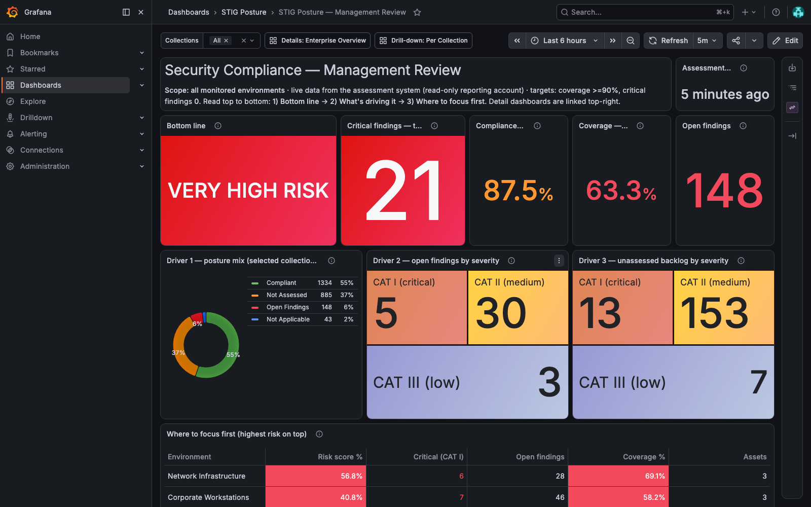
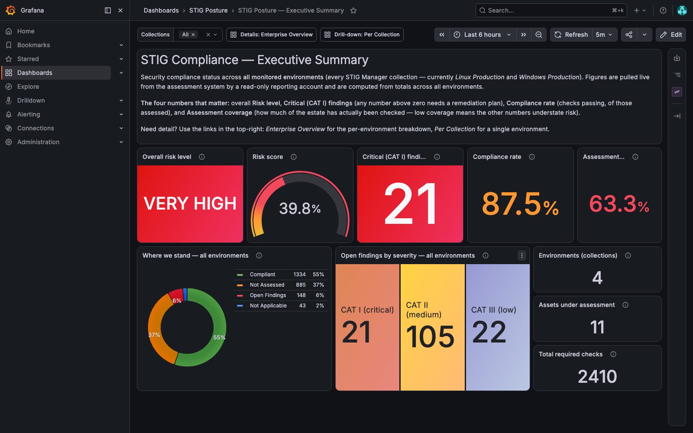
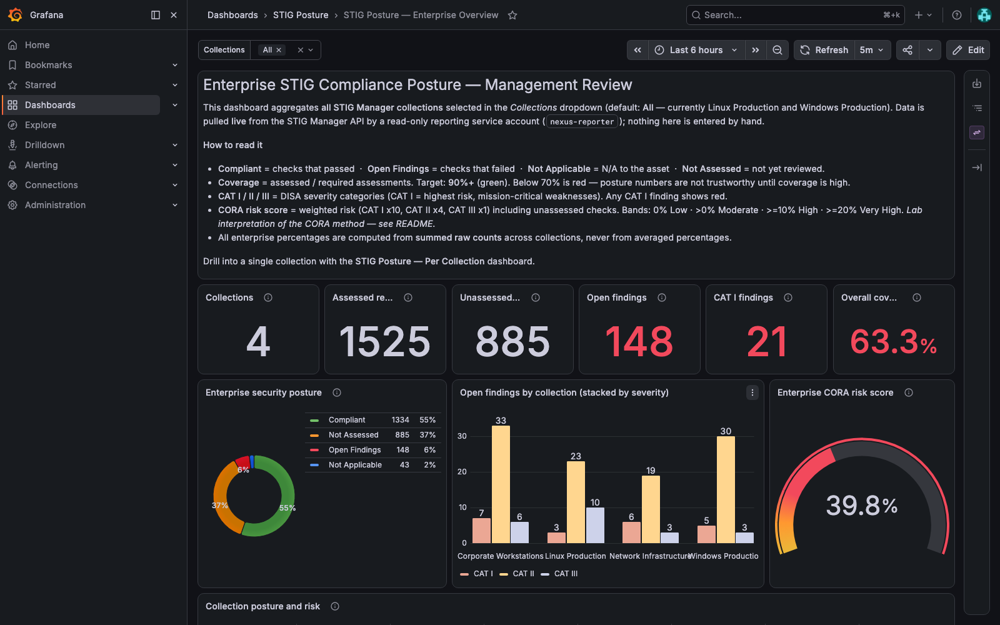
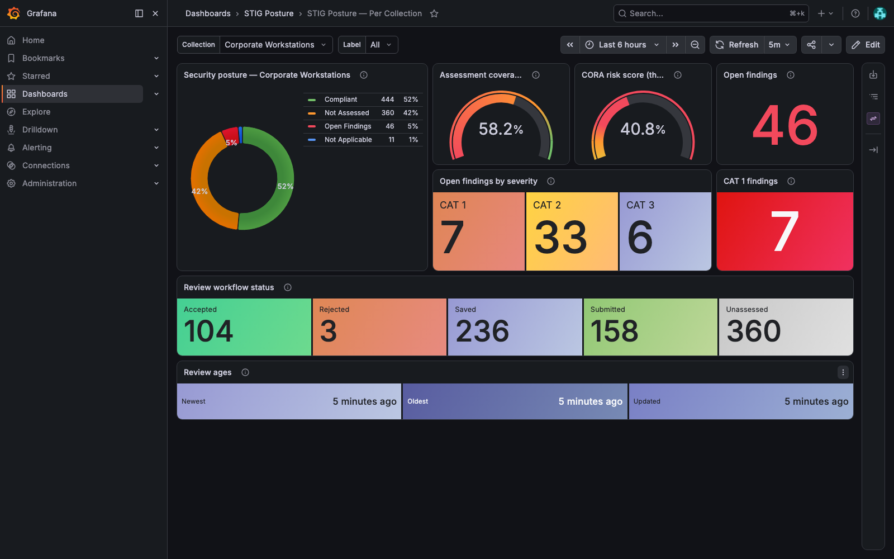
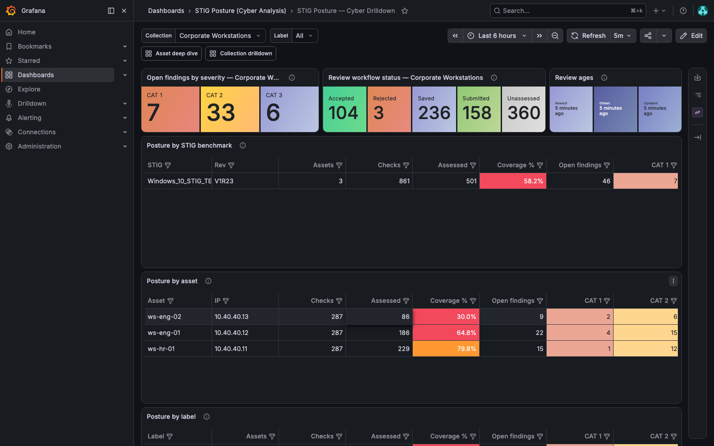
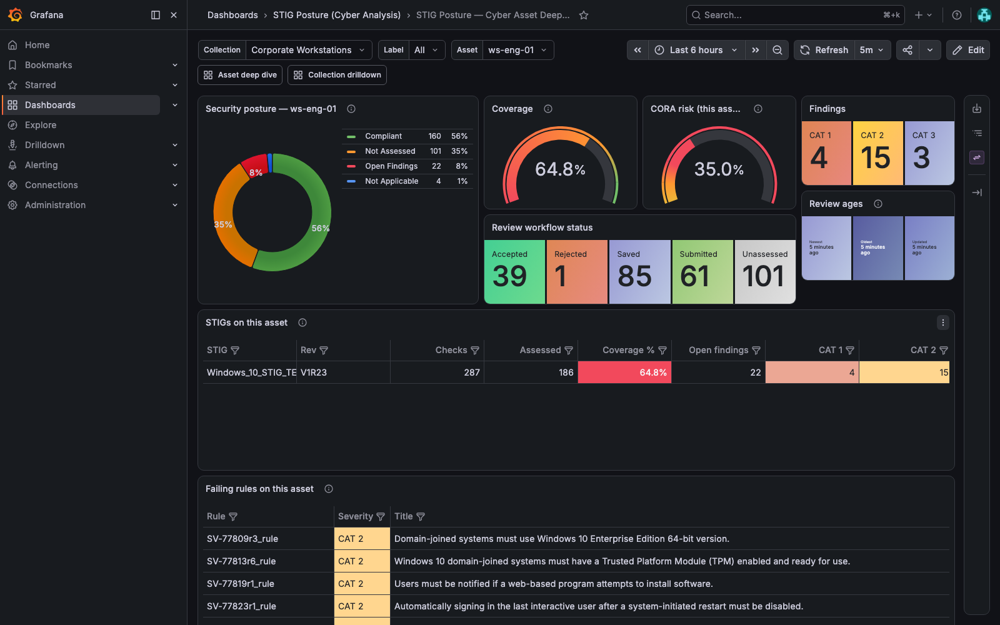
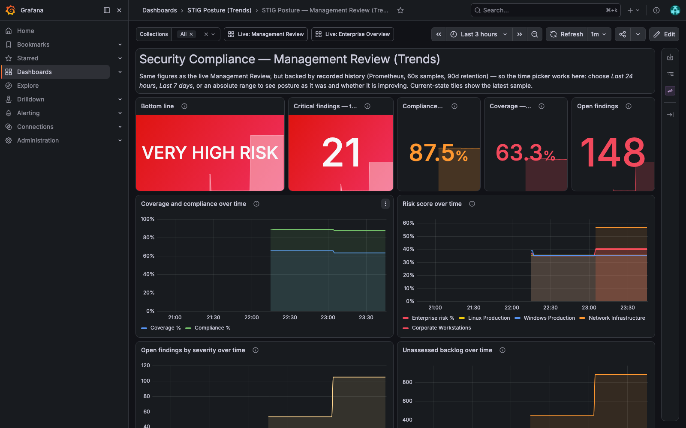
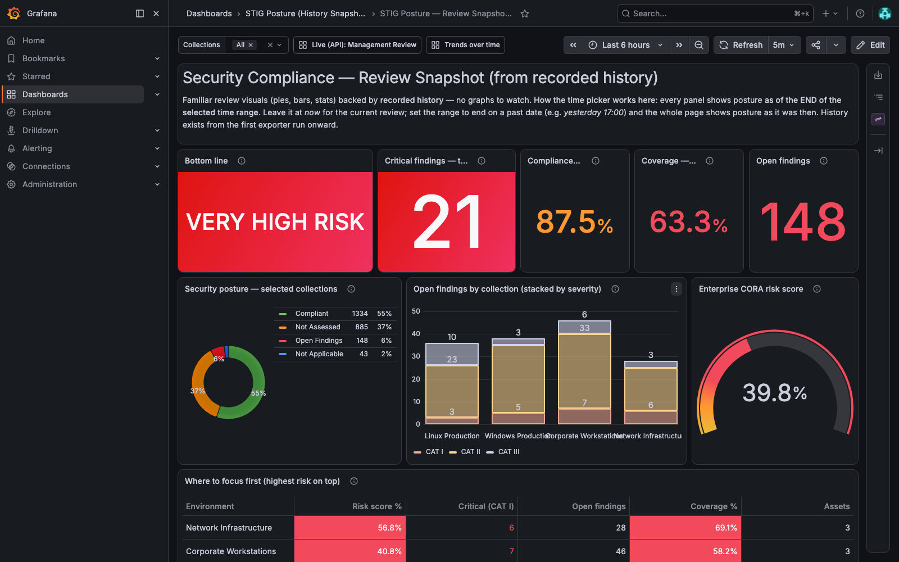

# STIG Manager → Grafana Posture Reporting

Turn [STIG Manager](https://github.com/NUWCDIVNPT/stig-manager) assessment
data into management-ready and analyst-ready Grafana dashboards:

> STIG Manager REST API → Keycloak OAuth2 (read-only service account) →
> Grafana Infinity datasource → provisioned dashboards, plus a Prometheus
> exporter that records posture **history** for trends and point-in-time
> snapshots.

Everything is generated, provisioned and validated end-to-end: four
dashboard folders (live, cyber analysis, trends, history snapshots),
native STIG Manager severity/status colors, CORA-style risk scoring,
collection and label filtering, and a least-privilege service account
(`nexus-reporter`, read-only grants only).

## Dashboards

**Management Review** — five-second verdict, targets on every KPI, drivers,
and a ranked "where to focus first" list:



**Executive Summary** — one page for leadership, all collections aggregated:



**Enterprise Overview** — analyst-grade aggregate with per-collection
breakdown and repeated posture donuts:



**Per Collection** — one collection's posture, workflow status and review
ages, mirroring the native STIG Manager metrics panel (same colors):



**Cyber Drilldown** — pivot by STIG benchmark, asset and label; every
column filterable; "top failing rules" remediation hit list:



**Cyber Asset Deep Dive** — a single asset's posture, per-STIG breakdown
and its complete failing-rule punch list:



**Trends** — Prometheus-recorded history, so the time picker answers
"are we getting better?":



**History Snapshots** — the same review visuals (pies/bars/stats) evaluated
at the end of any selected time range: set the range to yesterday and the
whole page shows yesterday's posture:



## Quick start (connected / commercial environment)

Prerequisites: Docker Engine 24+ with Compose v2, plus `curl`, `jq`,
`python3`, `openssl`. Ports 54000, 8180, 3200 and 9091 free.

```bash
git clone https://github.com/allamiro/stigman-grafana-dashboards.git
cd stigman-grafana-dashboards/stigmanager-grafana-lab

./scripts/generate-env.sh          # .env with random secrets
docker compose up -d               # STIG Manager, Keycloak, Grafana,
                                   # Prometheus + exporter, databases
./scripts/wait-for-stack.sh

./scripts/seed-test-data.sh        # 2 collections, mixed assessments
./scripts/seed-cyber-data.sh       # 2 more collections, labels, statuses
./scripts/grant-reporter-access.sh 1   # read-only grants for the reporter
./scripts/grant-reporter-access.sh 2   # (seed-cyber grants 3 & 4 itself)

./scripts/run-end-to-end-tests.sh  # full validation suite
```

Then open **http://localhost:3200** → *Sign in with Keycloak*
(`stigadmin` / `StigAdmin123!`) → *Dashboards*. STIG Manager itself is at
**http://localhost:54000**, Keycloak at **http://localhost:8180**,
Prometheus at **http://localhost:9091**.

Full documentation — architecture, Keycloak/OIDC wiring, version table,
CORA explanation, troubleshooting, production hardening, 1.5.9
compatibility notes:
**[stigmanager-grafana-lab/README.md](stigmanager-grafana-lab/README.md)**

## Air-gapped deployment

Deploying against an existing STIG Manager/Keycloak on a disconnected
network (what to carry across, Keycloak client setup, exporter as a
systemd service or container on your Prometheus server, Kubernetes
manifests, dashboard URL rewriting, verification order):
**[stigmanager-grafana-lab/AIRGAP.md](stigmanager-grafana-lab/AIRGAP.md)**

## Repository layout

```
stigmanager-grafana-lab/
├── docker-compose.yml        # full lab stack (pinned versions)
├── README.md                 # complete lab documentation
├── AIRGAP.md                 # air-gapped deployment guide
├── keycloak/realm-import/    # realm: clients, scopes, audience mapper
├── grafana/
│   ├── provisioning/         # datasources (Infinity, Prometheus) + folders
│   ├── dashboards/           # live dashboards (Infinity)
│   ├── dashboards-cyber/     # analyst drill-down dashboards
│   ├── dashboards-trends/    # Prometheus trend dashboards
│   └── dashboards-snapshots/ # point-in-time history dashboards
├── metrics-history/          # Prometheus exporter: local / Docker / k8s
├── compat/                   # parallel STIG Manager 1.5.9 test harness
└── scripts/                  # seed, grants, validation, dashboard generators
```

License: [MIT](LICENSE). Lab configuration only — see the production
hardening section of the lab README before using any of it outside a lab.
