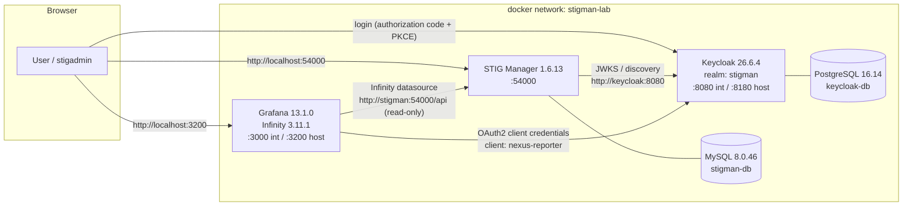

# STIG Manager → Grafana Posture Reporting Lab

A fully validated local Docker Compose lab that demonstrates an end-to-end
management reporting workflow:

> STIG Manager assessment data → STIG Manager REST API → Keycloak
> service-account (OAuth2 client-credentials) authentication → Grafana
> Infinity datasource → automatically provisioned STIG posture dashboards.

Everything here is **development/lab configuration** (plain HTTP, Keycloak
`start-dev`, default lab passwords). See [Production hardening](#production-hardening)
before reusing any of it outside a lab.

---

## 1. Architecture



Auth flows:

* **Interactive users** (STIG Manager UI, Grafana UI) authenticate in the
  browser against `http://localhost:8180/realms/stigman` using Authorization
  Code + PKCE.
* **Reporting** uses the confidential client `nexus-reporter`
  (client-credentials grant, no browser flow, no direct access grants). Its
  Keycloak service account appears in STIG Manager as
  `service-account-nexus-reporter` and holds **read-only** collection grants.

## 2. Prerequisites

* Docker Engine 24+ with Docker Compose v2 (tested on Docker 29 / Compose v5)
* `curl`, `jq`, `python3`, `openssl` on the host (for scripts)
* Free host ports **54000**, **8180**, **3200**

## 3. Versions (pinned and tested together)

| Component | Image | Version | Notes |
|---|---|---|---|
| STIG Manager | `nuwcdivnpt/stig-manager` | 1.6.13 | latest release at build time |
| STIG Manager DB | `mysql` | 8.0.46 | MySQL 8.0 is the supported DB |
| Keycloak | `quay.io/keycloak/keycloak` | 26.6.4 | `start-dev --import-realm` (lab only) |
| Keycloak DB | `postgres` | 16.14-alpine | |
| Grafana | `grafana/grafana` | 13.1.0 | |
| Infinity datasource | `yesoreyeram-infinity-datasource` | 3.11.1 | requires Grafana ≥ 11.6 |
| Prometheus | `prom/prometheus` | v3.13.1 | posture history (trends) |
| stigman-exporter | built from `metrics-history/exporter` | 1.0.0 | Python 3.12 |

## 4. Quick start (empty directory → dashboards)

```bash
# 1. configure environment (creates .env with random client/DB secrets)
./scripts/generate-env.sh          # or: cp .env.example .env  (then edit secrets)

# 2. start
docker compose config -q           # validate
docker compose pull
docker compose up -d

# 3. wait until healthy
./scripts/wait-for-stack.sh

# 4. seed demo data (2 collections, 5 assets, ~850 mixed reviews)
./scripts/seed-test-data.sh

# 5. give the reporting service account read-only access
./scripts/grant-reporter-access.sh 1
./scripts/grant-reporter-access.sh 2

# 6. validate everything
./scripts/run-end-to-end-tests.sh
```

Then open **http://localhost:3200** → *Dashboards → STIG Posture*.

## 5. Application URLs

| Application | URL | Notes |
|---|---|---|
| STIG Manager | http://localhost:54000 | as planned |
| Keycloak | **http://localhost:8180** | ⚠ deviation: host port 8080 was already in use on the build machine |
| Grafana | **http://localhost:3200** | ⚠ deviation: host port 3000 was already in use on the build machine |
| Keycloak admin console | http://localhost:8180 (master realm) | |
| Prometheus | **http://localhost:9091** | ⚠ deviation: host port 9090 was already in use on the build machine |
| Dashboards | http://localhost:3200/dashboards → folders *STIG Posture* and *STIG Posture (Trends)* | |

Databases are **not** published to the host on purpose.

> To move Keycloak/Grafana back to 8080/3000, change the port mappings in
> `docker-compose.yml` **and** every `localhost:8180` / `localhost:3200`
> reference in `docker-compose.yml` and
> `keycloak/realm-import/stigman-realm.json` (redirect URIs/web origins),
> then recreate the stack and re-import the realm.

## 6. Default lab credentials (change in `.env`)

| Purpose | Username | Password |
|---|---|---|
| Keycloak admin (master realm) | `admin` | `KeycloakAdmin123!` |
| STIG Manager / Grafana lab admin (SSO) | `stigadmin` | `StigAdmin123!` |
| Grafana local fallback admin | `admin` | `GrafanaAdmin123!` |
| Reporting client | `nexus-reporter` | secret in `.env` (`NEXUS_REPORTER_CLIENT_SECRET`) |

`./scripts/generate-env.sh` randomizes all client/database secrets; the three
interactive passwords above keep documented defaults for lab convenience.

## 7. How Keycloak is wired (internal vs. external URLs)

Keycloak deliberately runs **without** a fixed `KC_HOSTNAME`, so the issuer
follows the request host:

* Browsers use `http://localhost:8180/realms/stigman`.
* Containers use `http://keycloak:8080/realms/stigman`.

STIG Manager handles this split with its two documented settings — **no token
validation is disabled**:

* `STIGMAN_OIDC_PROVIDER=http://keycloak:8080/realms/stigman` — where the API
  fetches OIDC metadata and JWKS signing keys (container network).
* `STIGMAN_CLIENT_OIDC_PROVIDER=http://localhost:8180/realms/stigman` — the
  authority the web client sends browsers to.
* `STIGMAN_JWT_AUD_VALUE=stig-manager` — audience validation is **enforced**;
  the realm adds `aud=stig-manager` to tokens through a Keycloak audience
  mapper (client scope `stig-manager-audience`).

Grafana is configured the same way: `auth_url` points at
`localhost:8180` (browser), `token_url` at `keycloak:8080` (server-side), and
the Infinity datasource token URL is
`http://keycloak:8080/realms/stigman/protocol/openid-connect/token`.
`api_url` (userinfo) is deliberately unset: with a dynamic issuer, userinfo at
`keycloak:8080` would reject browser-issued tokens, so Grafana reads
email/name/username/roles from the ID token instead (the realm's `grafana`
client maps `realm_access.roles` into the ID token).

### Realm contents (auto-imported on first start)

`keycloak/realm-import/stigman-realm.json` creates:

* Realm `stigman` with realm roles `admin`, `create_collection`
  (STIG Manager privileges via `realm_access.roles`) and `grafana_admin`
  (mapped to Grafana `GrafanaAdmin` via `role_attribute_path`).
* Client `stig-manager` — public, Authorization Code + PKCE (S256), redirect
  `http://localhost:54000/*`. *Direct Access Grants is enabled as a
  **lab-only** convenience so the seed/grant scripts can obtain stigadmin
  tokens non-interactively; disable it in production.*
* Client `grafana` — confidential, standard flow only, redirect
  `http://localhost:3200/login/generic_oauth`.
* Client `nexus-reporter` — confidential, **service accounts only** (standard,
  implicit and direct-access flows all disabled), `fullScopeAllowed=false`,
  default scopes limited to `stig-manager:collection:read`,
  `stig-manager:stig:read`, `stig-manager:user:read`, `stig-manager:op:read`
  (+ `profile` so the token carries
  `preferred_username=service-account-nexus-reporter`, and the audience scope).
* User `stigadmin` / `StigAdmin123!` (no forced password reset).
* Client secrets are **not stored in the JSON** — Keycloak substitutes
  `${NEXUS_REPORTER_CLIENT_SECRET}` / `${GRAFANA_OIDC_CLIENT_SECRET}` /
  `${STIGMAN_ADMIN_PASSWORD}` from container environment variables at import
  time (they come from `.env`).

The realm is imported only when it does not exist yet. After editing the JSON:
`docker compose exec` delete the realm in the admin console (or
`DELETE /admin/realms/stigman`) and `docker compose restart keycloak`.

## 8. STIG Manager API endpoints used (verified against live 1.6.13 OAS)

Checked against `GET /api/op/definition` of the running instance:

| Purpose | Endpoint |
|---|---|
| List collections | `GET /api/collections` |
| Per-collection summary metrics | `GET /api/collections/{collectionId}/metrics/summary/collection` |
| Cross-collection summary metrics | `GET /api/collections/meta/metrics/summary/collection?collectionId=1&collectionId=2` |
| Live API definition | `GET /api/op/definition` |

> **Documented deviation from the original plan:** in STIG Manager 1.6.13 the
> multi-collection roll-up lives under `/api/collections/meta/metrics/...`.
> The path `/api/collections/metrics/summary/collection` does **not** exist in
> this version. The enterprise dashboard uses the `meta` endpoint and filters
> the selected collections inside the Infinity query
> (`filterExpression: collectionId IN (${collections:singlequote})`), which
> also avoids repeated query-string parameters.

The summary metrics object provides everything the dashboards need, including
per-severity data: `metrics.results.{pass,fail,notapplicable,other}`,
`metrics.assessments`, `metrics.assessed`, `metrics.findings.{high,medium,low}`,
`metrics.assessmentsBySeverity.*` and `metrics.assessedBySeverity.*`.

## 9. Grafana provisioning

* **Datasource** `grafana/provisioning/datasources/infinity.yml` — Infinity
  datasource, stable UID `stigmanager-infinity`, auth `oauth2` /
  `client_credentials`, token URL
  `http://keycloak:8080/realms/stigman/protocol/openid-connect/token`,
  allowed host `http://stigman:54000`. The client secret is injected from the
  container environment into Grafana **secure JSON** storage
  (`secureJsonData.oauth2ClientSecret`) — it is never written to dashboards or
  committed files.
* **Dashboards** `grafana/provisioning/dashboards/dashboards.yml` — loads
  `grafana/dashboards/*.json` into folder *STIG Posture*, refreshed every 30 s.
  Every panel references UID `stigmanager-infinity` directly; there are no
  `${DS_*}` placeholders.
* `scripts/update-enterprise-dashboard.py` regenerates
  `stig-posture-enterprise.json` deterministically (single source of truth for
  the enterprise panel set and the aggregation math).

## 10. Dashboards

### STIG Posture — Management Review (`/d/stig-posture-management`)

The recommended dashboard for manager/leadership reviews, built on published
executive-dashboard best practices (five-second rule, inverted-pyramid
layout, targets on every KPI, actionable bottom tier):

* **Tier 1 — Bottom line:** verdict tile (LOW/MODERATE/HIGH/VERY HIGH RISK,
  top-left, largest), critical findings vs target 0, compliance vs target
  90 %, coverage vs target 90 %, open findings.
* **Tier 2 — Drivers:** posture mix donut, open findings by severity,
  unassessed backlog by severity (the two components of the risk score).
* **Tier 3 — Action:** "Where to focus first" — environments ranked by risk
  score, worst on top, so the review ends with priorities.

An **"Assessments last updated"** tile (from `maxTouchTs`) shows how fresh
the underlying review data is, so a green dashboard is never mistaken for a
recently-verified one.

Generated by `scripts/update-management-dashboard.py` (reuses the enterprise
generator's math). No collection picker: it always covers everything. For
history/trends, see the Trends variant in section 10a.

### STIG Posture — Executive Summary (`/d/stig-posture-executive`)

The management view: one page, **all collections aggregated**, no drill-down
clutter. Framing text panel, plain-language risk verdict
(LOW/MODERATE/HIGH/VERY HIGH via the CORA score), critical-findings tile,
compliance rate (`sum(pass)/sum(assessed)`), assessment coverage, overall
posture donut, findings by severity, and scope tiles (environments, assets,
total checks). Links in the top-right lead to the two detail dashboards.
Regenerated by `scripts/update-executive-dashboard.py` (reuses the enterprise
generator's query builders so the math cannot drift).

### STIG Posture — Per Collection (`/d/stig-posture-collection`)

Collection dropdown fed from `GET /api/collections`
(`name` → label, `collectionId` → value).

| Panel | Source / math |
|---|---|
| Security posture donut | Compliant=`results.pass`, Not Applicable=`results.notapplicable`, Open Findings=`results.fail`, Not Assessed=`assessments-assessed`; colors green/blue/red/orange. Workflow statuses (saved/submitted/accepted/rejected) are intentionally excluded. |
| Assessment coverage gauge | `assessed/assessments` ×100, guarded for ÷0; red <70, orange 70–89, green ≥90 |
| Open findings stat | `results.fail` (red when ≥1) |
| CAT I findings stat | `findings.high`, red background when ≥1 |
| Open findings by severity | horizontal bars: CAT I=`findings.high`, CAT II=`findings.medium`, CAT III=`findings.low` |
| CORA risk gauge | see [CORA](#cora-risk-score) below |

### STIG Posture — Enterprise Overview (`/d/stig-posture-enterprise`)

Multi-select collection variable (defaults to *All*). **All enterprise numbers
sum raw counts first and compute percentages afterwards** (Infinity
`summarizeExpression`); collection percentages and CORA values are never
averaged.

* Stat tiles: total collections, assessed reviews, unassessed reviews
  (`sum(assessments)-sum(assessed)`), open findings, CAT I findings
  (red ≥1), overall coverage (`sum(assessed)/sum(assessments)`).
* Enterprise posture donut: `sum(pass)`, `sum(notapplicable)`, `sum(fail)`,
  `sum(assessments)-sum(assessed)`.
* Open findings by collection, stacked CAT I/II/III.
* Collection posture and risk table (per-row coverage % and CORA %,
  color-coded).
* Enterprise CORA gauge — severity counts summed across the selection, then
  the CORA formula applied once.
* Repeated per-collection posture donuts (panel repeat over the variable).

## 10a. Posture history and trend dashboards (`metrics-history/`)

The STIG Manager API is point-in-time — the Grafana time picker has no effect
on the Infinity dashboards, which always show *current* posture. To answer
"what was our posture yesterday / are we improving?", the lab records history:

```
stigman-exporter (Python) ── /metrics ──> Prometheus (60s scrape, 90d retention)
        │                                        │
        └── OAuth2 client-credentials            └── Grafana "STIG Posture (Trends)"
            (nexus-reporter, read-only)              folder, datasource uid
            -> STIG Manager meta metrics API         stigmanager-prometheus
```

`metrics-history/exporter/stigman_exporter.py` exposes per-collection gauges
(`stigman_collection_assessments`, `..._assessed`, `..._results{result=}`,
`..._findings{severity=}`, `..._assessments_by_severity`,
`..._assessed_by_severity`, `..._cora_percent`,
`..._last_touch_timestamp_seconds`, plus scrape health metrics). The CORA
math is identical to the dashboards.

**Three ways to run the exporter** (one directory per setup):

| Mode | How |
|---|---|
| Local (your box, no Docker) | `./metrics-history/local/run-local.sh` → http://localhost:9633/metrics (creates a venv, reads secrets from the lab `.env`) |
| Docker standalone | `./metrics-history/docker/run-docker.sh` (builds `stigman-exporter:1.0.0`, `docker run -d`, port 9633) |
| Kubernetes | `metrics-history/kubernetes/`: `kubectl apply -f namespace.yaml`, copy `secret.example.yaml` → `secret.yaml` (fill in secrets, not committed), apply `deployment.yaml` + `service.yaml`; `servicemonitor.yaml` if you run prometheus-operator. Build/push the image first (see comments in the manifests). |

The compose stack also runs the exporter and Prometheus automatically
(`docker compose up -d --build` after pulling these changes):

* Prometheus UI: **http://localhost:9091** (documented deviation: host 9090
  was occupied on the build machine); config in
  `metrics-history/prometheus/prometheus.yml`, 90-day retention, named volume.
* The exporter is not published to the host from compose — only Prometheus
  scrapes it.

**Trend dashboards** (Grafana folder *STIG Posture (Trends)*, generated by
`scripts/update-trend-dashboards.py`, datasource `stigmanager-prometheus`):

* `STIG Posture — Management Review (Trends)` — same tier-1 KPIs as the live
  Management Review (latest sample) plus time-series panels: coverage &
  compliance over time, risk score over time (enterprise + per collection),
  open findings by severity over time, unassessed backlog over time. The
  time picker works here.
* `STIG Posture — Per Collection (Trends)` — collection dropdown (Prometheus
  label values) with the same trends for a single collection.

**History snapshot dashboards** (folder *STIG Posture (History Snapshots)*,
generated by `scripts/update-snapshot-dashboards.py`): the same review-style
visuals as the Infinity dashboards — pie charts, bar charts, stats, gauges,
ranked focus table — but built from Prometheus **instant queries**, which
evaluate at the **end of the selected time range**. Leave the range at *now*
for the current review, or set the range end to a past date/time and every
panel shows posture as of that moment — no time-series to watch:

* `STIG Posture — Review Snapshot (All Collections)`
* `STIG Posture — Review Snapshot (Per Collection)` (dropdown)

Note: trends and snapshots exist from the moment the exporter first runs —
history cannot be backfilled for dates before that.

## 10b. Version compatibility (tested: 1.6.13 and 1.5.9)

`compat/docker-compose.stigman-1.5.9.yml` stands up a parallel STIG Manager
1.5.9 with its own fresh MySQL on the same network (port 54001), reusing the
main Keycloak realm:

```bash
docker compose -f compat/docker-compose.stigman-1.5.9.yml --project-directory . up -d
STIGMAN_URL=http://localhost:54001 ./scripts/seed-test-data.sh
STIGMAN_URL=http://localhost:54001 ./scripts/grant-reporter-access.sh 1
STIGMAN_URL=http://localhost:54001 ./scripts/test-collection-metrics.sh 1
# tear down (removes its DB volume):
docker compose -f compat/docker-compose.stigman-1.5.9.yml --project-directory . down -v
```

Result of the live test: **1.5.9 is fully compatible** — identical auth
(realm/scopes/audience), identical grants model (roleId + read-only ACL),
and the metrics summary already includes the per-severity CORA fields. All
seed/grant/test scripts and all dashboard queries work unchanged.

Rules when changing versions:

* **Never point an older image at a newer database** — migrations are
  forward-only (1.6.13 had migrated far beyond 1.5.9's migration 40). Use a
  fresh volume (as the compat file does) or wipe `stigman-db-data`.
* If the STIG Manager **hostname/port changes**, update the Infinity
  datasource `allowedHosts` and the dashboard query URLs — otherwise
  Infinity rejects the request ("requested URL not allowed"). With the same
  hostname, nothing changes on the Grafana side.
* **Browser login to the parallel instance** needs its redirect URI added
  to the Keycloak `stig-manager` client (otherwise Keycloak shows
  *Invalid parameter: redirect_uri*): admin console → Clients →
  `stig-manager` → add `http://localhost:54001/*` to *Valid redirect URIs*
  and `http://localhost:54001` to *Web origins*. API/token calls need no
  change — only the browser flow uses redirects. Note this is a live
  Keycloak change; a realm re-import reverts it.
* Versions **older than the 1.5.9-era releases** may lack the
  `assessmentsBySeverity`/`assessedBySeverity` fields (CORA gauges) or the
  grantId/ACL model — check `GET /api/op/definition` first.

## 11. CORA risk score

Implemented exactly as specified, per severity category:

```
unassessedHigh   = assessmentsBySeverity.high   - assessedBySeverity.high
p1 = (findings.high   + unassessedHigh)   / assessmentsBySeverity.high
p2 = (findings.medium + unassessedMedium) / assessmentsBySeverity.medium
p3 = (findings.low    + unassessedLow)    / assessmentsBySeverity.low

CORA = ((p1 × 10) + (p2 × 4) + (p3 × 1)) / 15        (shown as %)
```

Zero denominators are guarded with ternaries (a severity with no assessments
contributes 0) so the gauge can never show `NaN`/`Infinity`/empty. Bands used:
0 % Low, >0 % Moderate, ≥10 % High, ≥20 % Very High.

> **Caveat (as labeled on the panels):** this is a lab interpretation of the
> CORA weighted-average approach. DISA's official CORA methodology also has
> rules this simplified formula does not model (e.g., excluding empty
> categories from the weight denominator instead of contributing 0, and the
> "Low vs. Very Low" distinction). Verify against current DISA CORA guidance
> before treating the score as authoritative.

## 12. Test-data procedure

`./scripts/seed-test-data.sh` automates all of this; the manual equivalent:

1. **Get STIG content.** Official source: DISA Document Library
   (https://public.cyber.mil/stigs/downloads/) — download the *STIG
   Compilation* zip (`U_SRG-STIG_Library_*.zip`) or individual STIG zips. The
   lab script instead downloads two small XCCDF benchmarks published in the
   STIG Manager project's public test fixtures (RHEL 7, Windows 10) to keep
   the download small.
2. **Import benchmarks:** STIG Manager UI → *STIG Library* (as an
   Application Manager) → import, or
   `POST /api/stigs?elevate=true&clobber=true` (multipart `importFile`).
3. **Create collections** `Linux Production` and `Windows Production`
   (UI *Create Collection*, or `POST /api/collections` — note the API takes
   the `grants` array literally: include yourself as `roleId: 4` owner).
4. **Create assets** and assign STIGs (`POST /api/assets` with
   `stigs: ["<benchmarkId>"]`).
5. **Create mixed results:** `POST /api/collections/{id}/reviews/{assetId}`
   with an array of `{ruleId, result, detail, comment, status}`. The seed
   script creates open CAT I/II/III findings (`fail`), passes,
   `notapplicable` reviews, and leaves 10–60 % of each checklist unassessed so
   coverage, posture and CORA all show meaningful, visibly different values
   per collection.
6. **Grant the reporter** read access (next section) and verify:
   `./scripts/test-service-account.sh`, `./scripts/test-collection-metrics.sh 1`.
7. Open the dashboards.

## 13. Service-account permissions (read-only)

STIG Manager 1.6 uses collection grants (`roleId` 1=restricted … 4=owner)
plus per-grant ACLs (`r` / `rw`). Collection grants can only be created after
a collection exists, so this is a post-seed step.

**Scripted (preferred):**

```bash
./scripts/grant-reporter-access.sh <collectionId>
```

It looks up the `service-account-nexus-reporter` user, creates a grant with
`roleId: 1` (Restricted — the lowest role) and applies a collection-wide ACL
of `[{"access": "r"}]`, making the grant read-only for every asset/STIG in
the collection. `test-service-account.sh` additionally proves a write attempt
is rejected (HTTP 403).

**Manual UI fallback:** log in to STIG Manager as `stigadmin` → open the
collection → *Manage* → *Grants* → *New grant* → user
`service-account-nexus-reporter`, role **Restricted** → edit the grant's
*Access Control List* → add a single rule covering the whole collection with
access **Read**.

**Expected behavior:** `GET /api/collections` returning `HTTP 200` with `[]`
means authentication succeeded but the service account has **no collection
grants yet** — it is not an authentication failure. STIG Manager only lists
collections the caller has been granted.

Note: the service account's STIG Manager user record is created on its first
authenticated API call (`test-service-account.sh` triggers this) — run that
once before granting if the user lookup fails.

## 14. Validation scripts

| Script | What it proves |
|---|---|
| `wait-for-stack.sh` | DB containers healthy; Keycloak master + stigman realms answer; STIG Manager API and Grafana health respond (bounded retries) |
| `test-keycloak.sh` | realm + discovery + token endpoint; `nexus-reporter` obtains a token; validates `iss`, `aud=stig-manager`, `azp`, `sub`, `preferred_username=service-account-nexus-reporter`; asserts the scope set is read-only. Never prints the secret. |
| `test-service-account.sh` | client-credentials → `GET /api/collections`; prints HTTP status + JSON; explains the `[]` case; proves writes are rejected |
| `test-collection-metrics.sh <id>` | summary metrics: required fields exist, are numeric, and are internally consistent (`pass+fail+na+other == assessed`) |
| `test-grafana.sh` | health, Infinity plugin 3.11.1, datasource UID/auth/allowed-hosts/secure secret, both dashboard UIDs, all panels reference `stigmanager-infinity`, live query through Infinity returns collections |
| `validate-dashboard-queries.py <uid>` | executes **every panel query** of a dashboard via `/api/ds/query` with variables substituted; fails on error or empty data |
| `run-end-to-end-tests.sh` | runs everything above in order and prints the PASS/FAIL summary; nonzero exit on failure |

## 15. Troubleshooting

| Symptom | Cause / fix |
|---|---|
| STIG Manager redirect loop | Browser can't reach the issuer the client was told to use. `STIGMAN_CLIENT_OIDC_PROVIDER` must be a browser-reachable URL (`http://localhost:8180/...`), not `http://keycloak:8080/...`. |
| Keycloak issuer mismatch (`invalid token issuer`) | Something pinned `KC_HOSTNAME` or a proxy rewrites Host. This lab relies on Keycloak's dynamic issuer: browsers see `localhost:8180`, containers see `keycloak:8080`. Don't mix the two inside one consumer. |
| `invalid_client` / Invalid client credentials | `.env` secret differs from the imported realm secret (realm import only runs once). Either update the client secret in Keycloak admin, or delete the `stigman` realm and restart Keycloak to re-import with current env values. |
| `RedirectNotAllowed` / invalid redirect URI | The client's redirect URIs don't cover the actual URL (changed ports?). Fix redirect URIs in the realm (client `stig-manager`: `http://localhost:54000/*`; `grafana`: `http://localhost:3200/login/generic_oauth`). |
| Token audience mismatch (API 401 with aud error) | Tokens must carry `aud=stig-manager` (client scope `stig-manager-audience`). If you removed the mapper, also remove `STIGMAN_JWT_AUD_VALUE` (not recommended) or restore the scope on the client. |
| `GET /api/collections` returns `[]` | Authentication OK, **no grants**. Run `./scripts/grant-reporter-access.sh <id>`. |
| Infinity reports 401/unauthorized | Wrong `NEXUS_REPORTER_CLIENT_SECRET` in Grafana's env, or token URL unreachable *from the Grafana container* (must be `http://keycloak:8080/...`, not localhost). `docker compose logs grafana` shows the oauth2 error. |
| Infinity "host not allowed" | Query URL must start with the datasource's allowed host `http://stigman:54000`. Panels use the Docker-internal name on purpose. |
| Dashboard shows `No data` | Usually the reporter lost grants or collections are empty. Verify with `./scripts/test-service-account.sh` and `./scripts/validate-dashboard-queries.py stig-posture-collection`. |
| Collection variable empty | Same `[]` grants issue, or the datasource UID changed (must stay `stigmanager-infinity`). |
| CORA gauge shows `N/A` | The query errored (check panel inspector). The formula itself is ÷0-guarded; `N/A` therefore means no row came back — check grants/metrics first. |
| Database migration failures (stigman restarts) | MySQL not healthy yet or lost volume permissions. `docker compose logs stigman-db stigman`. The stack gates STIG Manager on MySQL's healthcheck; wipe `stigman-db-data` only if you accept losing data. |
| Keycloak realm import doesn't run | Import only happens when the realm doesn't exist. Delete realm `stigman` (admin console → realm settings → delete, or the admin REST API) and restart the `keycloak` container. |
| Grafana dashboards not provisioned | `docker compose logs grafana | grep -i provision`. JSON must be valid and the files mounted at `/var/lib/grafana/dashboards`. Regenerate with `python3 scripts/update-enterprise-dashboard.py`. |

## 16. Reset and cleanup

```bash
docker compose down              # stop, keep data
docker compose down -v           # stop and DELETE all volumes (full reset)
rm -rf test-data screenshots     # local artifacts
```

After `down -v`, the next `up -d` re-imports the realm and re-runs DB
migrations from scratch; re-run seed + grant scripts.

## 17. Production hardening

This lab intentionally accepts risks that are unacceptable in production:

| Area | Lab shortcut | Production requirement |
|---|---|---|
| TLS | plain HTTP everywhere | TLS 1.2+ end-to-end: reverse proxy (nginx/Traefik/HAProxy) terminating with **trusted CA certificates**; Keycloak `start` (prod mode) with `KC_HOSTNAME=https://sso.example.com`; `STIGMAN_CLIENT_OIDC_PROVIDER` and Grafana URLs all https. Never ship `tlsSkipVerify: true`. |
| Keycloak mode | `start-dev`, dynamic issuer | production mode behind a proxy (`KC_PROXY_HEADERS`), fixed hostname, HA cluster (2+ nodes, Infinispan), DB with failover |
| Secrets | `.env` file on disk | external secret manager (Vault, AWS/GCP secret stores, SOPS); inject at deploy time; no secrets in git, images, or dashboard JSON (the lab already keeps them out of git/dashboards) |
| Secret rotation | static lab secrets | rotate `nexus-reporter` and `grafana` client secrets on a schedule; Keycloak supports dual client secrets for zero-downtime rotation; automate via admin API |
| Lab conveniences | Direct Access Grants on `stig-manager` client; default passwords | disable Direct Access Grants; enforce strong unique passwords + MFA (Keycloak OTP/WebAuthn) for admins |
| Reporting account | Restricted role + read-only ACL (already least-privilege) | keep it that way: never an app admin, never write ACLs; one service account per consumer; audit grants periodically |
| Databases | no host ports (already), single instances | backups (mysqldump/XtraBackup, pg_dump/pgBackRest) with tested restores; PITR; patching cadence |
| Network | one Docker bridge | segment: SSO, data, and presentation tiers; only Grafana→Keycloak/STIG Manager and STIG Manager→Keycloak/DB paths open; deny-by-default egress |
| Containers | non-privileged (already), no host network (already) | also: read-only root FS where possible, `no-new-privileges`, resource limits, pinned digests, regular image scanning (Trivy/Grype) in CI |
| Grafana auth | Generic OAuth + local admin fallback | disable local logins (`GF_AUTH_DISABLE_LOGIN_FORM`) once SSO is proven, enable `role_attribute_strict`, sign-out redirect to Keycloak end-session, short token lifetimes |
| STIG Manager scale | single API container | multiple stateless API replicas behind the proxy; MySQL sized per vendor guidance; monitor `/api/op/appinfo` |
| Audit | container stdout only | ship Keycloak event logs (login/admin events), STIG Manager transaction logs, and Grafana audit logs to a SIEM; alert on service-account misuse (e.g., unexpected write attempts) |

## 18. Known limitations

* Keycloak realm import runs only on first boot; secret changes in `.env`
  afterwards require deleting/re-importing the realm (documented above).
* The CORA score is a lab interpretation (see caveat).
* `$collection`-style URLs mean the Infinity queries are dashboard-driven; the
  datasource's allowed-host list is the enforcement boundary.
* Grafana's local `admin` account remains enabled as a fallback (lab).
* Direct Access Grants on the public `stig-manager` client is enabled for
  script automation — lab only.
